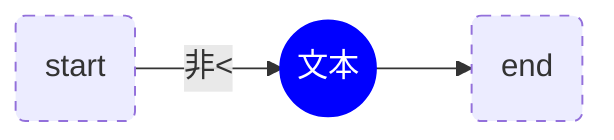
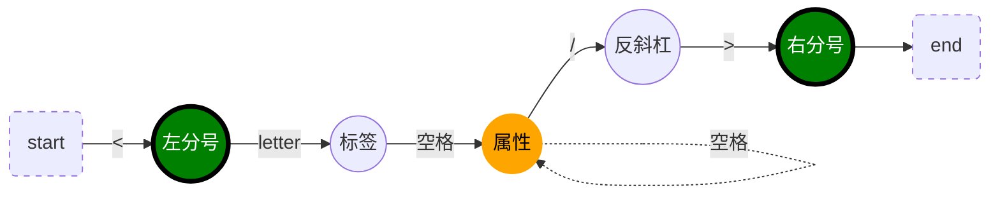
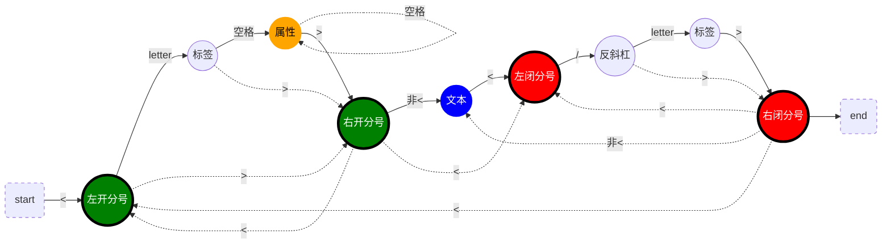
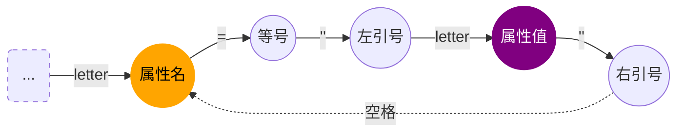
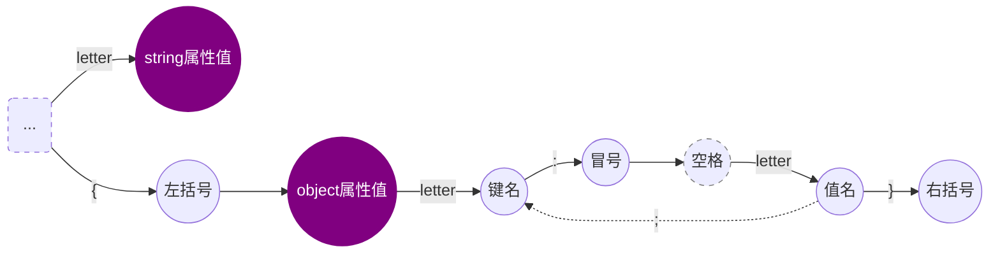

# 简易编译器从0到1

场景：将一段JSX语法的代码生成一个ast，并支持遍历和修改这个ast，将ast重新生成JS语法的代码

> JSX代码

```jsx
<h1 id="title"><span>hello</span>world</h1>
```
> JS代码

```js
React.createElement("h1", {
  id: "title"
},React.createElement("span", null, "hello"), "world");
```
## 有限状态机

原理：根据输入状态决定下一个状态

*注意：实线箭头表示常规路线，虚线箭头表示可能存在的分情况。letter有两种情况（英文或"_"）*

> 普通文本节点



- 左开分号和右闭分号之间非<或非>的内容都属于文本节点
- **注意**：JSX语法不存在直接返回一段字符串的情况，文本节点都会包裹在<></>的双闭合标签内，所以这种情况可以不用考虑（双闭合标签中已经考虑上了）

> 单闭合标签



- 实际词法转AST时，反斜杠则表示标签是单闭合的，并且下一个右分号直接完成此节点的解析
- 标签和属性都是同级的"属性"（AST节点属性）
- 单闭合标签没有孩子节点

> 双闭合标签



- 标签和属性都是同级的"属性"（AST节点属性）
- 右开分号后与左闭分号前包裹的属于孩子节点
- 右开分号后与左闭分号前之间也可能没有孩子节点（">"的下一个字符就是"<"）
- <..>或</..>无标签等英文字符，则表示这是一个"模板"双闭合标签

> 解析属性



- key-value的键值对

> 属性值



- string属性值：属性键值对形式（key：stringValue）
- object属性值：属性键值对形式（key：objectValue）

> 拓展一："模板"标签 <></>

TODO，实际也是双闭合标签的一个特种

> 拓展二：JSX表达式｛｝

TODO，标签属性值object形式可能是JSX表达式，如ref={this.input}；文本节点中的｛｝也是JSX表达式。

## 词法分析

原理：运用有限状态机的原理，JSX语法代码字符串逐个字符输入到功能状态机，由具体的功能状态机根据输入决定下一个状态。最终将所有结果emit出去

*注意：粗体英文字符表示功能状态机；—表示正常流程，---（+--或#--或~--等等）表示上一步可能的分情况；空格均不输出*

（TODO完善）

- — tokenizer函数：遍历字符，输入给状态机
- — emit函数：发射一个解析完成的记录｛type，value｝
- — **start**：入口状态机
  - — foundParen：“<”左开分号
  - --- 非<：start
- — **foundParen**：解析“<”左开分号
  - — letter：label
  - --- parenR：">"右开分号
    - — 非<：text
    - --- <：foundParen
  - +-- backSlash：“/”反斜杠，*case：单闭合标签*
    - — parenR：">"右开分号
- — tryFoundChildren：
- — **label**：解析标签名
  - — letter：标签名（的一个字符）
  - --- parenR：">"右开分号
  - +-- whiteSpace：" "空格
    - — attribute：属性
  - #-- backSlash：“/”反斜杠，*case：单闭合标签*
    - — parenR：">"右开分号
- — **attribute**：解析属性
  - — letter：属性名（的一个字符）
  - — equalSign："="等号
  - — quoMarkL："左引号
  - — attributeValue：属性值
  - — quoMarkR："右引号
  - — whiteSpace：" "空格
    - attribute：属性
  - --- parenR：发现">"右开分号
  - +-- backSlash：“/”反斜杠，*case：单闭合标签*
    - — parenR：发现">"右开分号
- — **attributeValue**：解析属性值
  - — letter：string属性值
  - --- bracketL："{"左大括号
    - — attributeObjectValue：object属性值
- — **attributeObjectValue**：解析object属性值
  - — letter：键名
  - — colon：":"冒号
  - — whiteSpace：空格（可能会缺省）
  - — letter：值名
  - — bracketR："}"右大括号
  - --- sem：";"分号
    - attributeObjectValue：obeject属性值
- — **text**：解析文本
  - — parenL：发现"<"左闭分号
  - — backSlash："/"反斜杠
  - — label：解析标签名
  - — parenR：发现">"右闭分号

## 语法分析

如何处理普通节点

如何处理单闭合节点</>

如何处理双闭合节点<></>

如何处理孩子节点

## 遍历器

## 访问器

## 生成器

------

如有不足，欢迎指出，共同进步！