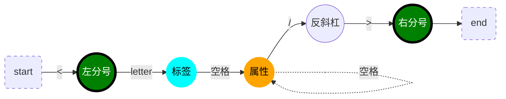
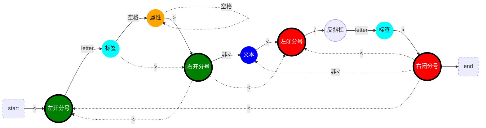
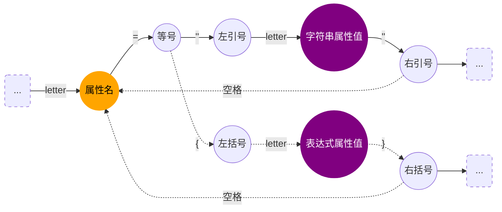
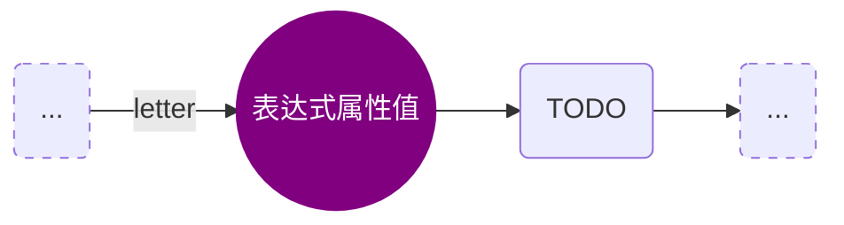

# 前端也需要了解的编译器从0到1

引言：

> 为什么需要编译器？
>
> 1. 其实你可以理解编译器就是翻译器，当中国人去英国旅游的时候，中国人说中文，但是，英国当地说英文，中文没办法使用，这个时候就需要翻译器，将中文转成英文，这样当地人就明白你的意思了。有了翻译器，中国人就可以去任何语言的国家旅游了，很方便吧！
>
> 读完这篇文章，你能收获的知识：
>
> 1. 对前端编译原理有比较深刻的认识，甚至可以自己尝试手写一个babel-loader，这下你终于明白了，自己写的代码，为什么能够运行到这个环境里了！
> 2. 对树数据结构，树遍历，以及递归都有比较深刻的了解，原来面试问的都不只是造火箭呢！
>
> *欢迎指出我的不足！*

前端涉及到编译原理的地方实在太多了，ES6转ES5，JSX转JS，less转css，ts转js等等...

编译原理无处不在，正如尤大所说，会编译原理真的可以为所欲为，学习编译原理刻不容缓！

所以，为了搞明白编译器，干脆自己实现一个简版的，就从最近入门的react中JSX语法入手，实现JSX语法转成JS语法的编译器

需求：将一段JSX语法的代码生成一个ast，并支持遍历和修改这个ast，将ast重新生成JS语法的代码

> JSX代码

```jsx
<h1 id="title"><span>hello</span>world</h1>
```
> reactJs代码

```js
React.createElement("h1", {
  id: "title"
},React.createElement("span", null, "hello"), "world");
```
## 有限状态机

原理：根据输入状态决定下一个状态

*注意：实心圆表示一个功能状态机；实线箭头表示常规情况，虚线箭头表示可能存在的分情况。letter只考虑两种形式（英文或"_"）*

> 单闭合标签



- 实际词法转AST时，反斜杠则表示标签是单闭合的，并且下一个右分号直接完成此节点的解析
- 标签和属性都是同级的"属性"（AST节点属性）
- 单闭合标签没有孩子节点

> 双闭合标签



- 标签和属性都是同级的"属性"（AST节点属性）
- 右开分号后与左闭分号前包裹的属于孩子节点
- 右开分号后与左闭分号前之间也可能没有孩子节点（">"的下一个字符就是"<"）

> 解析属性



- key-value（属性名-属性值）的键值对

> 拓展一：JSX表达式属性值（TODO）



- letter
- this.letter
- {letter:字符串/letter}

> 拓展二：JSX表达式文本（TODO）

文本节点中的{}

> 拓展三：<></>“模板”双闭合标签

_可以实现分词功能的除了有限状态机，还有正则匹配._

## 词法分析

原理：运用有限状态机的原理，JSX语法代码字符串逐个字符输入到功能状态机，由具体的功能状态机根据输入决定下一个状态。最终将所有结果emit出去

*注意：粗体英文字符表示功能状态机；—表示正常流程，---（+--或#--或~--等等）表示上一步可能的分情况；空格（等号，分号，大括号）均不输出*

- — tokenizer函数：遍历字符，输入给状态机
- — emit函数：发射一个解析完成的记录｛type，value｝
- — **start**：入口状态机
  - — foundParen："<"左开分号
  - --- 非<：start
- — **foundParenL**：发现"<"左开分号
  - — letter：label
  - --- backSlash：“/”反斜杠，label
- — **foundParenR**：发现">"右开分号
  - — <：foundParenL
  - --- 非<：text
- — **label**：解析标签名
  - — letter：标签名（的一个字符）
  - --- parenR：">"右开分号，foundParenR
  - +-- whiteSpace：" "空格，attribute
- — **attribute**：解析属性
  - — letter：属性名，attributeKey
- — **attributeKey**：解析属性名
  - — letter：属性名（的一个字符串）
  - — equalSign："="等号，attributeValue
- — **attributeValue**：解析属性值
  - — quoMark："左引号，attributeStringValue
  - --- bracketL："{"左大括号，attributeJSXValue
- — **attributeStringValue**：解析字符串属性值
  - — letter：字符串属性值
  - — quoMark："右引号，tryLeaveAttribute
- — **attributeJSXValue**：解析表达式属性值
  - — letter：表达式属性值
  - — bracketR："}"右大括号，tryLeaveAttribute
- — **tryLeaveAttribute**：尝试退出属性的分析
  - — whiteSpace：" "空格，attribute
  - --- parenR：">"右开分号，foundParenR
- — **text**：解析文本
  - 非<：文本内容
  - — <："<"左开分号或左闭分号，foundParenL

实现：

```js
let LETTERS = /^[a-zA-Z0-9_]$/;
let NOT_LEFT_SEM = /^</;

let currentToken = { type: "", value: "" };
let tokens = [];

function emit(token) {
    // console.log(token);
    currentToken = { type: "", value: "" }; // 清空一下currentToken，避免污染下一个单词
    tokens.push(token);
}

function start(char) {
    if (char === "<") {
        emit({ type: "parenLeft", value: "<" });
        return foundParenL;
    }
    return start;
}

function foundParenL(char) {
    if (LETTERS.test(char)) {
        currentToken.value = char;
        currentToken.type = "label";
        return label;
    } else if (char === "/") {
        emit({ type: "backSlash", value: "/" });
        return foundParenL;
    }
    throw new TypeError("Error");
}

function foundParenR(char) {
    if (char === "<") {
        emit({ type: "parenLeft", value: "<" });
        return foundParenL;
    } else {
        // 文本节点
        currentToken.value = char;
        currentToken.type = "text";
        return text;
    }
}

function label(char) {
    if (LETTERS.test(char)) {
        currentToken.value += char;
        return label;
    } else if (char === " ") {
        // 空格不输出
        emit(currentToken);
        return attribute;
    } else if (char === ">") {
        emit(currentToken);
        emit({ type: "parenRight", value: ">" });
        return foundParenR;
    }
    throw new TypeError("Error");
}

function attribute(char) {
    if (LETTERS.test(char)) {
        currentToken.value = char;
        currentToken.type = "attributeKey";
        return attributeKey;
    }
    throw new TypeError("Error");
}

function attributeKey(char) {
    if (LETTERS.test(char)) {
        currentToken.value += char;
        return attributeKey;
    } else if (char === "=") {
        emit(currentToken);
        // emit({type: "equalSign", value: "="})
        return attributeValue;
    }
    throw new TypeError("Error");
}

function attributeValue(char) {
    if (char === '"') {
        // emit({type: "quoMarkLeft", value: "\""});
        currentToken.value = "";
        currentToken.type = "attributeStringValue";
        return attributeStringValue;
    } else if (char === "{") {
        // emit({type: "bracketL", value: "{"});
        currentToken.value = "";
        currentToken.type = "attributeJSXValue";
        return attributeJSXValue;
    }
    throw new TypeError("Error");
}

function attributeStringValue(char) {
    if (LETTERS.test(char)) {
        currentToken.value += char;
        return attributeStringValue;
    } else if (char === '"') {
        emit(currentToken);
        // emit({type: "quoMarkRight", value:"\""})
        return tryLeaveAttribute;
    }
    throw new TypeError("Error");
}

function attributeJSXValue(char) {
    if (LETTERS.test(char)) {
        currentToken.value += char;
        return attributeJSXValue;
    } else if (char === "}") {
        emit(currentToken);
        // emit({type: "bracketR", value:"}"})
        return tryLeaveAttribute;
    }
    throw new TypeError("Error");
}

function tryLeaveAttribute(char) {
    if (char === " ") {
        return attribute;
    } else if (char === ">") {
        emit({ type: "parenRight", value: ">" });
        return foundParenR;
    }
    throw new TypeError("Error");
}

function text(char) {
    if (char === "<") {
        emit(currentToken);
        emit({ type: "parenLeft", value: "<" });
        return foundParenL;
    } else {
        // 文本内容
        currentToken.value += char;
        return text;
    }
}

function tokenizer(input) {
    tokens = [];
    let state = start;
    for (let char of input) {
        state = state(char);
    }
    return tokens;
}

module.exports = {
    tokenizer
};

// let code = '<h1 id="title"><span>hello</span>world</h1>';

// tokenizer(code);
```


分词结果：

```js
{ type: 'parenLeft', value: '<' }
{ type: 'label', value: 'h1' }
{ type: 'attributeKey', value: 'id' }
{ type: 'attributeStringValue', value: 'title' }
{ type: 'parenRight', value: '>' }
{ type: 'parenLeft', value: '<' }
{ type: 'label', value: 'span' }
{ type: 'parenRight', value: '>' }
{ type: 'text', value: 'hello' }
{ type: 'parenLeft', value: '<' }
{ type: 'backSlash', value: '/' }
{ type: 'label', value: 'span' }
{ type: 'parenRight', value: '>' }
{ type: 'text', value: 'world' }
{ type: 'parenLeft', value: '<' }
{ type: 'backSlash', value: '/' }
{ type: 'label', value: 'h1' }
{ type: 'parenRight', value: '>' }
```

## 语法分析

首先，弄明白，分词结果中哪些结果是我们需要的，而哪些结果是我们不需要的。如果你不太确定，请配合[astexplorer](https://astexplorer.net/)使用，这是一个在线生成AST的工具

然后，弄明白，分词结果中，哪些是入口，哪些是出口。结合有限状态机，很明显，<...>是标签的入口，</...>是标签的出口，抓住这一点，递归方法walk就很好写了。接下来，只需要关心入口和出口之间的属性，和孩子节点

最后，遍历分词结果生成一棵AST。分词数组的移动指针是个关键，注意在合适的时机，应该采用自增的方式跳过处理某个单词，代码中充分显示这个特点，这也是debug花时间最多的地方，看来真的还要多深入了解递归思想呢！

实现：

```js
const { tokenizer } = require('./tokenizer');

function parser(code) {
    let tokens = tokenizer(code);
    let current = 0; // tokens移动指针
    function walk(parent) {
        let token = tokens[current]; // 当前单词
        let next = tokens[current + 1]; // 下一个单词，因为这里需要预判一下当前<是属于开分号还是闭分号
        if (token.type === 'parenLeft' && token.value == '<' && next.type === 'label') {
            let node = {
                type: 'JSXElement',
                openingElement: null,
                closingElement: null,
                children: []
            }
            token = tokens[++current]; // 标签
            let labelName = token.value; // 标签名

            node.openingElement = {
                type: 'JSXOpeningElement',
                name: {
                    type: "JSXIdentifier",
                    name: token.value
                },
                attributes: []
            }

            token = tokens[++current]; // 跳过标签

            while (token.type != 'parenRight' && token.type === "attributeKey") { // walk所有属性
                node.openingElement.attributes.push(walk());
                token = tokens[current];
            }

            token = tokens[++current]; // 跳过>单词
            next = tokens[current+1]; // 下一个单词，反斜杠
            next_next = tokens[current+2]; // 下一个单词，标签

            // 根据结束标签的标签名一致，中间的内容都是孩子节点
            while (token.type !== 'parenLeft' || token.type === 'parenLeft' && next.type !== 'backSlash' && next_next.value !== labelName) { // walk所有孩子
                node.children.push(walk());
                token = tokens[current];
                next = tokens[current+1]; // 下一个单词，反斜杠
                next_next = tokens[current+2]; // 下一个单词，标签
            }

            node.closingElement = walk(node); // walk闭合标签
            
            return node;
        } 
        else if(parent && token.type === 'parenLeft' && token.value == '<' && next.type === 'backSlash'){
            current++; // 跳过<单词
            token = tokens[++current]; // 闭合标签，跳过反斜杠
            current++; // 跳过标签
            current++; // 跳过>单词
            return parent.closingElement = {
                type: "JSXClosingElement",
                name: {
                    type: "JSXIdentifier",
                    name: token.value
                }
            }
        }
        else if(token.type === "attributeKey"){
            let next = tokens[++current]; // attributeValue // 只处理了attributeStringValue的情况
            let node = {
                type: "JSXAttribute",
                name: {
                    type: "JSXIdentifier",
                    name: token.value
                },
                value: {
                    type: "StringLiteral",
                    value: next.value
                }
            }
            current++; // 跳过attributeValue
            return node
        }
        else if(token.type === "text"){
            current++; // 跳过>单词
            return {
                type: "JSXText",
                value: token.value
            }
        }
        throw new TypeError(token.type);
    }

    // ast根节点
    var ast = {
        type: 'Program',
        body: [
            {
                type: 'ExpressionStatement',
                expression: null
            }
        ]
    };

    // walk
    ast.body[0].expression = walk();

    return ast;
}

module.exports = {
    parser
}

// let code = '<h1 id="title"><span>hello</span>world</h1>';

// console.log(JSON.stringify(parser(code), null, 2));
```


语法分析结果：

```js
{
  "type": "Program",
  "body": [
    {
      "type": "ExpressionStatement",
      "expression": {
        "type": "JSXElement",
        "openingElement": {
          "type": "JSXOpeningElement",
          "name": {
            "type": "JSXIdentifier",
            "name": "h1"
          },
          "attributes": [
            {
              "type": "JSXAttribute",
              "name": {
                "type": "JSXIdentifier",
                "name": "id"
              },
              "value": {
                "type": "StringLiteral",
                "value": "title"
              }
            }
          ]
        },
        "closingElement": {
          "type": "JSXClosingElement",
          "name": {
            "type": "JSXIdentifier",
            "name": "h1"
          }
        },
        "children": [
          {
            "type": "JSXElement",
            "openingElement": {
              "type": "JSXOpeningElement",
              "name": {
                "type": "JSXIdentifier",
                "name": "span"
              },
              "attributes": []
            },
            "closingElement": {
              "type": "JSXClosingElement",
              "name": {
                "type": "JSXIdentifier",
                "name": "span"
              }
            },
            "children": [
              {
                "type": "JSXText",
                "value": "hello"
              }
            ]
          },
          {
            "type": "JSXText",
            "value": "world"
          }
        ]
      }
    }
  ]
}
```

## 访问器

作用：在遍历抽象语法树时，提供给用户可以自定义的"进入"或"退出"某种类型节点时调用的函数。形式可以是函数或是{enter函数，exist函数}对象

例子：

```js
let code = '<h1 id="title"><span>hello</span>world</h1>';

let ast = parser(code);
traverse(ast, {
    JSXOpeningElement: {
        enter: function (node, parent) {
            console.log('进入开标签', node);
        },
        exit: function (node, parent) {
            console.log('退出开标签', node);
        }
    }
})
```

## 遍历器

递归遍历抽象语法树，这里采取的先序遍历方式：先访问自己再依次访问孩子。需要在访问节点的前面调用enter函数，和结束访问节点的后面调用exist函数

实现：

```js
// 遍历器（JSX语法树和ReactJS语法树）
// 访问器是用户自定义的

const { parser } = require('./parser');

function traverse(ast, visitor) {
    function traverseArray(array, parent) {
        array.forEach(function (child) {
            traverseNode(child, parent);
        });
    }

    function traverseNode(node, parent) {
        if(node && typeof node.replaceWith !== 'function'){ // 给每一个node添加一个replaceWith方法，用于替换父节点中的node
            // 替换逻辑
            node.replaceWith = (newNode)=>{
                if(parent){
                    for (const key in parent) {
                        if (parent.hasOwnProperty(key)) {
                            if(parent[key] === node){
                                parent[key] = newNode;
                            }
                        }
                    }
                }
            }
        }
        var method = visitor[node.type];
        if (method) {
            node.node = node; // 添加一个node属性指向自己，转换器中是这样使用的nodePath.node
            if (typeof method === 'function') {
                method(node, parent)
            } else if (method.enter) {
                method.enter(node, parent);
            }
        }
        switch (node.type) {
            case 'Program':
                traverseArray(node.body, node);
                break;
            case 'ExpressionStatement': // 表达式
                traverseNode(node.expression, node);
                break;
            // JSX标签的遍历
            case 'JSXElement': // JSX标签
                traverseNode(node.openingElement, node);
                traverseNode(node.closingElement, node);
                traverseArray(node.children, node);
                break;
            case 'JSXOpeningElement': // 开标签
                traverseNode(node.name, node); // 标签名
                traverseArray(node.attributes, node);
                break;
            case 'JSXAttribute': // 属性
                traverseNode(node.name, node); // 属性名
                traverseNode(node.value, node); // 属性值
                break;
            case 'JSXClosingElement': // 闭合标签
                traverseNode(node.name, node); // 标签名
                break;
            case 'JSXIdentifier': // 属性名
                break;
            case 'StringLiteral': // 字符串属性值，字符串参数
                break;
            case 'JSXText': // 文本
                break;
            // ReactJS的遍历
            case 'CallExpression':
                traverseNode(node.callee, node); // 成员表达式
                traverseArray(node.arguments, node); // 参数列表
                break;
            case 'MemberExpression':
                traverseNode(node.object, node); // （成员）对象
                traverseNode(node.property, node); // （成员）对象属性
                break;
            case 'Identifier': // "变量"名
                break;
            case 'ObjectExpression': // 对象数组
                traverseArray(node.properties, node); // 对象
                break;
            case 'ObjectProperty': // 对象属性
                traverseNode(node.key, node); // 对象属性名
                traverseNode(node.value, node); // 对象属性值
                break;
            case 'NullLiteral':
                break;
            default:
                throw new TypeError(node.type);
        }
        if (method && method.exit) {
            node.node = node; // 同样，也需要添加一个node.node属性
            method.exit(node, parent);
        }
    }

    // 开始遍历ast
    traverseNode(ast, null);
}

module.exports = {
    traverse
};


// let code = '<h1 id="title"><span>hello</span>world</h1>';

// let ast = parser(code);
// traverse(ast, {
//     JSXOpeningElement: {
//         enter: function (node, parent) {
//             console.log('进入开标签', node);
//         },
//         exit: function (node, parent) {
//             console.log('退出开标签', node);
//         }
//     }
// })
```


## 转换器

这是一个可以将jsx代码转成一段js的加载器代码，是基于babel编译器写的。为了能让我的加载器运行起来，模仿babel编译的方式，我给自己定义了一些接口和类（如：节点替换函数replaceWith，节点类型判断类t）

实现：

```js
// 转换器（loader的作用）

const { traverse } = require('./traverse');
const { parser } = require('./parser');

class t { // 这里模拟@babel/types的一些方法
    static nullLiteral() {
        return {
            type: 'NullLiteral'
        }
    }

    static memberExpression(object, property) {
        return {
            type: 'MemberExpression',
            object,
            property
        }
    }

    static identifier(name) {
        return {
            type: 'Identifier',
            name
        }
    }

    static stringLiteral(value) {
        return {
            type: 'StringLiteral',
            value
        }
    }

    static objectExpression(properties) {
        return {
            type: 'ObjectExpression',
            properties
        }
    }

    static objectProperty(key, value) {
        return {
            type: 'ObjectProperty',
            key,
            value
        }
    }

    static callExpression(callee, _arguments) {
        return {
            type: 'CallExpression',
            callee,
            arguments: _arguments
        }
    }

    static isJSXText(node) {
        return node.type === 'JSXText'
    }

    static isJSXElement(node) {
        return node.type === 'JSXElement';
    }
}

function transformer(ast) {
    traverse(ast, {
        JSXElement(nodePath) {
            const next = (node) => {
                if (!node) return t.nullLiteral();
                // JSX 标签节点
                if (t.isJSXElement(node)) {
                    // React.createElement函数
                    let memberExpression = t.memberExpression(
                        t.identifier("React"),
                        t.identifier("createElement")
                    );
                    // 函数参数列表
                    let _arguments = [];
                    // 标签
                    let stringLiteral = t.stringLiteral(node.openingElement.name.name);
                    // 属性
                    let objectExpression = node.openingElement.attributes.length
                        ? t.objectExpression(
                            node.openingElement.attributes.map((attr) =>
                                t.objectProperty(t.identifier(attr.name.name), attr.value)
                            )
                        )
                        : t.nullLiteral();
                    _arguments = [stringLiteral, objectExpression];
                    // 递归处理子节点
                    _arguments.push(...node.children.map((item) => next(item)));
                    return t.callExpression(memberExpression, _arguments);
                } else if (t.isJSXText(node)) {
                    // JSX 文本节点
                    return t.stringLiteral(node.value);
                }
            };
            let targetNode = next(nodePath.node);
            nodePath.replaceWith(targetNode);
        },
    });
}

module.exports = {
    transformer
}


// let code = '<h1 id="title"><span>hello</span>world</h1>';

// let ast = parser(code);
// transformer(ast)
// console.log("转义后的ast: %s", JSON.stringify(ast, null, 2));
```


转换结果：

```js
{
  "type": "Program",
  "body": [
    {
      "type": "ExpressionStatement",
      "expression": {
        "type": "CallExpression",
        "callee": {
          "type": "MemberExpression",
          "object": {
            "type": "Identifier",
            "name": "React"
          },
          "property": {
            "type": "Identifier",
            "name": "createElement"
          }
        },
        "arguments": [
          {
            "type": "StringLiteral",
            "value": "h1"
          },
          {
            "type": "ObjectExpression",
            "properties": [
              {
                "type": "ObjectProperty",
                "key": {
                  "type": "Identifier",
                  "name": "id"
                },
                "value": {
                  "type": "StringLiteral",
                  "value": "title"
                }
              }
            ]
          },
          {
            "type": "CallExpression",
            "callee": {
              "type": "MemberExpression",
              "object": {
                "type": "Identifier",
                "name": "React"
              },
              "property": {
                "type": "Identifier",
                "name": "createElement"
              }
            },
            "arguments": [
              {
                "type": "StringLiteral",
                "value": "span"
              },
              {
                "type": "NullLiteral"
              },
              {
                "type": "StringLiteral",
                "value": "hello"
              }
            ]
          },
          {
            "type": "StringLiteral",
            "value": "world"
          }
        ]
      }
    }
  ]
}
```

## 生成器

到这一步基本是水到渠成的事情了，你只需要采取先序遍历抽象语法树，将特定的节点类型转换成对应的js代码即可

实现：

```js
// 生成器（只生成ReactJS代码）

function codeGenerator(node) {
    switch (node.type) {
        case 'Program':
            return node.body.map(codeGenerator).join('\n');

        // ReactJS的代码生成器
        case 'ExpressionStatement':
            return (
                codeGenerator(node.expression) + ';'
            );

        case 'MemberExpression':
            return (
                codeGenerator(node.object) +
                '.' +
                codeGenerator(node.property)
            )

        case 'ObjectExpression':
            return (
                '{' +
                node.properties.map(codeGenerator).join(', ') +
                '}'
            )

        case 'ObjectProperty':
            return (
                codeGenerator(node.key) +
                ':' +
                codeGenerator(node.value)
            )

        case 'CallExpression':
            return (
                codeGenerator(node.callee) +
                '(' +
                node.arguments.map(codeGenerator).join(', ') +
                ')'
            );

        case 'Identifier':
            return node.name;

        case 'NumberLiteral':
            return node.value;

        case 'StringLiteral':
            return '"' + node.value + '"';

        case 'NullLiteral':
            return '"null"'

        default:
            throw new TypeError(node.type);
    }
}

module.exports = {
    codeGenerator
}
```


## 参考

[github]: 	" tiny-compiler"


