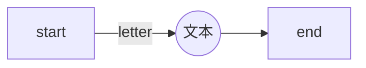
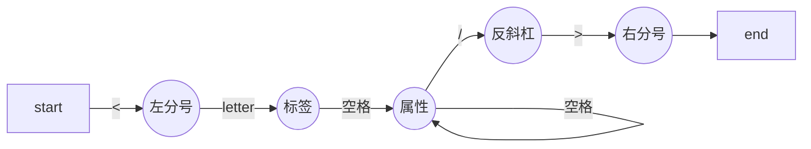
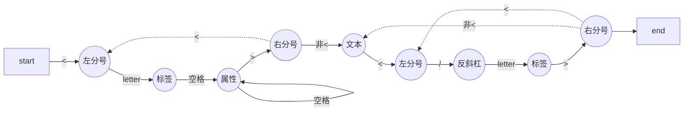
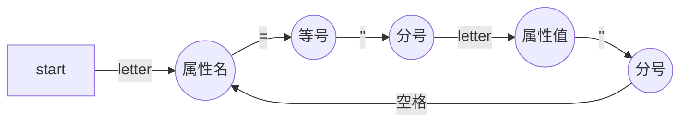

# 简易编译器从0到1

目标：将一段JSX语法的代码生成一个ast，并支持遍历和修改这个ast，将ast重新生成JS语法的代码

> JSX代码

```jsx
<h1 id="title"><span>hello</span>world</h1>
```
> JS代码

```js
React.createElement("h1", {
  id: "title"
},React.createElement("span", null, "hello"), "world");
```
## 有限状态机

原理：根据输入状态决定下一个状态

> 普通文本节点



> 单闭合标签



> 双闭合标签



> 解析属性



## 词法分析

## 语法分析

如何处理普通节点

如何处理单闭合节点</>

如何处理双闭合节点<></>

如何处理孩子节点

## 遍历器

## 访问器

## 生成器