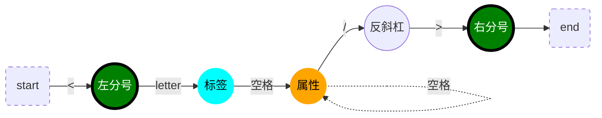
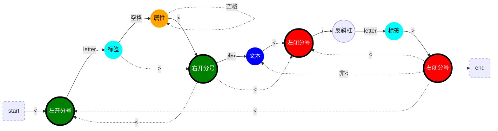
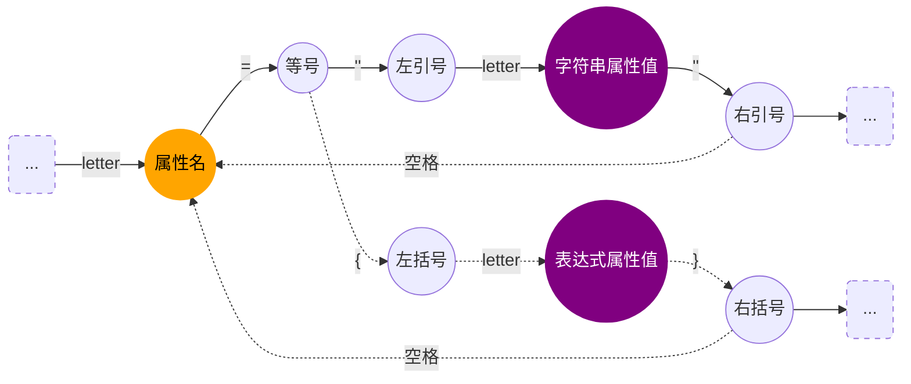
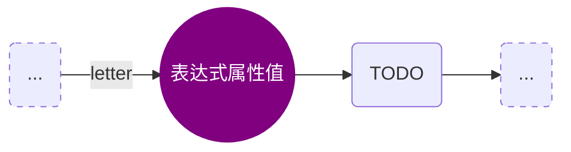

# 简易编译器从0到1

场景：将一段JSX语法的代码生成一个ast，并支持遍历和修改这个ast，将ast重新生成JS语法的代码

> JSX代码

```jsx
<h1 id="title"><span>hello</span>world</h1>
```
> JS代码

```js
React.createElement("h1", {
  id: "title"
},React.createElement("span", null, "hello"), "world");
```
## 有限状态机

原理：根据输入状态决定下一个状态

*注意：实心圆表示一个功能状态机；实线箭头表示常规情况，虚线箭头表示可能存在的分情况。letter有两种情况（英文或"_"）*

> 单闭合标签



- 实际词法转AST时，反斜杠则表示标签是单闭合的，并且下一个右分号直接完成此节点的解析
- 标签和属性都是同级的"属性"（AST节点属性）
- 单闭合标签没有孩子节点

> 双闭合标签



- 标签和属性都是同级的"属性"（AST节点属性）
- 右开分号后与左闭分号前包裹的属于孩子节点
- 右开分号后与左闭分号前之间也可能没有孩子节点（">"的下一个字符就是"<"）

> 解析属性



- key-value（属性名-属性值）的键值对

> 拓展一：JSX表达式属性值（TODO）



- letter
- this.letter
- {letter:字符串/letter}

> 拓展二：JSX表达式文本（TODO）

文本节点中的{}

> 拓展三：<></>“模板”双闭合标签

## 词法分析

原理：运用有限状态机的原理，JSX语法代码字符串逐个字符输入到功能状态机，由具体的功能状态机根据输入决定下一个状态。最终将所有结果emit出去

*注意：粗体英文字符表示功能状态机；—表示正常流程，---（+--或#--或~--等等）表示上一步可能的分情况；空格均不输出*

- — tokenizer函数：遍历字符，输入给状态机
- — emit函数：发射一个解析完成的记录｛type，value｝
- — **start**：入口状态机
  - — foundParen："<"左开分号
  - --- 非<：start
- — **foundParenL**：发现"<"左开分号
  - — letter：label
  - --- backSlash：“/”反斜杠，label
- — **foundParenR**：发现">"右开分号
  - — <：foundParenL
  - --- 非<：text
- — **label**：解析标签名
  - — letter：标签名（的一个字符）
  - --- parenR：">"右开分号，foundParenR
  - +-- whiteSpace：" "空格，attribute
- — **attribute**：解析属性
  - — letter：属性名，attributeKey
- — **attributeKey**：解析属性名
  - — letter：属性名（的一个字符串）
  - — equalSign："="等号，attributeValue
- — **attributeValue**：解析属性值
  - — quoMark："左引号，attributeStringValue
  - --- bracketL："{"左大括号，attributeJSXValue
- — **attributeStringValue**：解析字符串属性值
  - — letter：字符串属性值
  - — quoMark："右引号，tryLeaveAttribute
- — **attributeJSXValue**：解析表达式属性值
  - — letter：表达式属性值
  - — bracketR："}"右大括号，tryLeaveAttribute
- — **tryLeaveAttribute**：尝试退出属性的分析
  - — whiteSpace：" "空格，attribute
  - --- parenR：">"右开分号，foundParenR
- — **text**：解析文本
  - 非<：文本内容
  - — <："<"左开分号或左闭分号，foundParenL

实现：./src/tokenizer.js

分词结果：


## 语法分析


## 遍历器

## 访问器

## 生成器

------

如有不足，欢迎指出，共同进步！